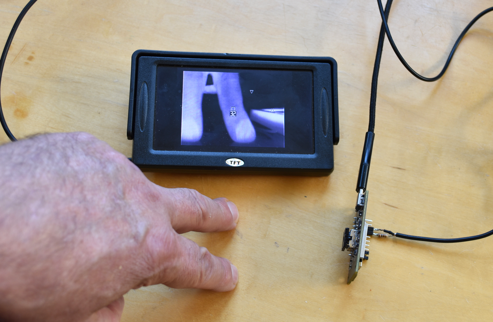
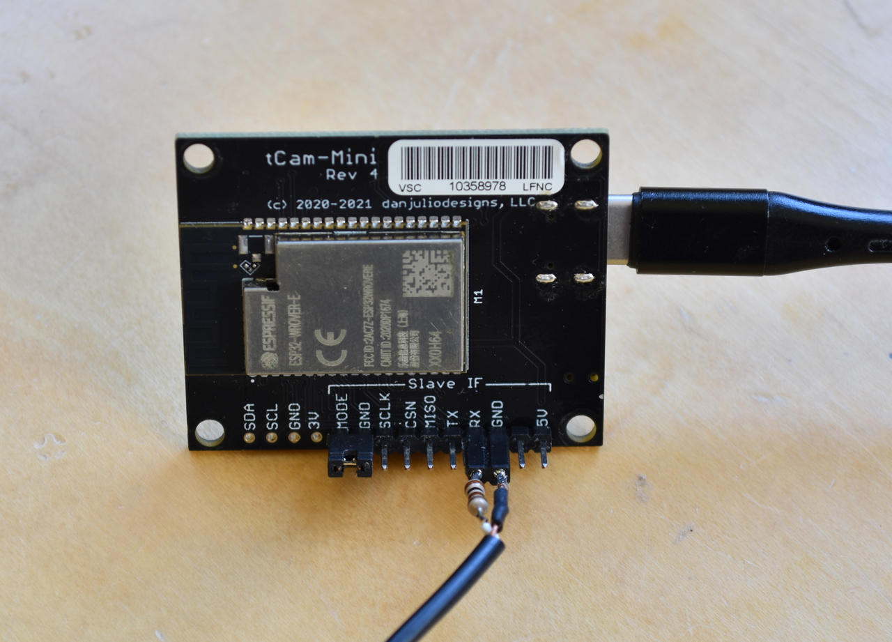
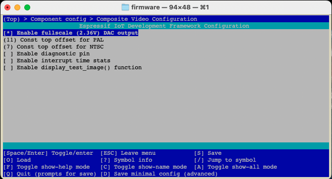
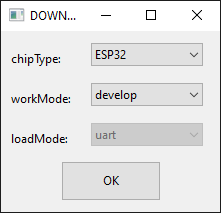
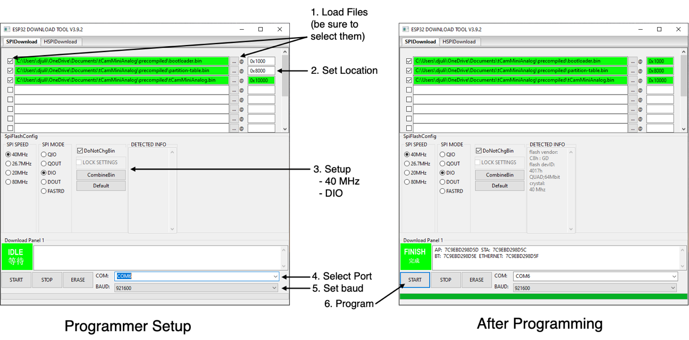
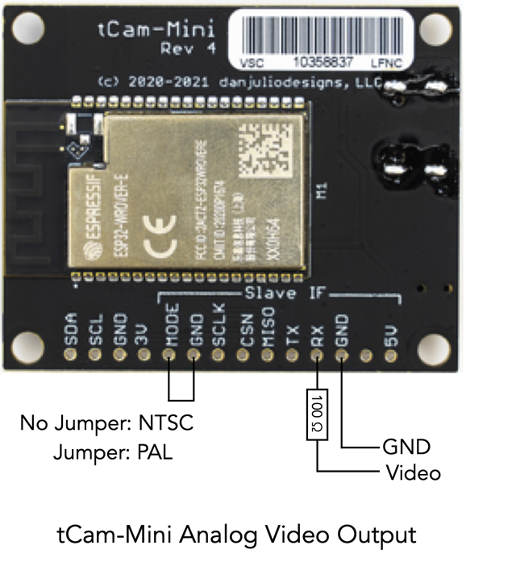
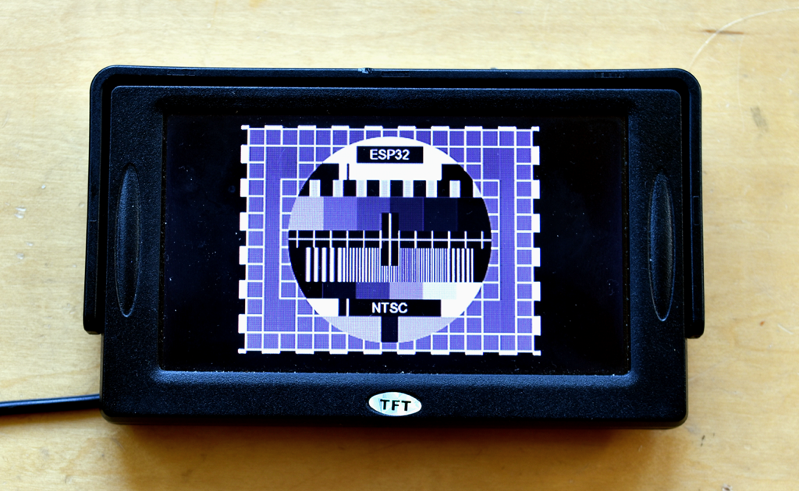
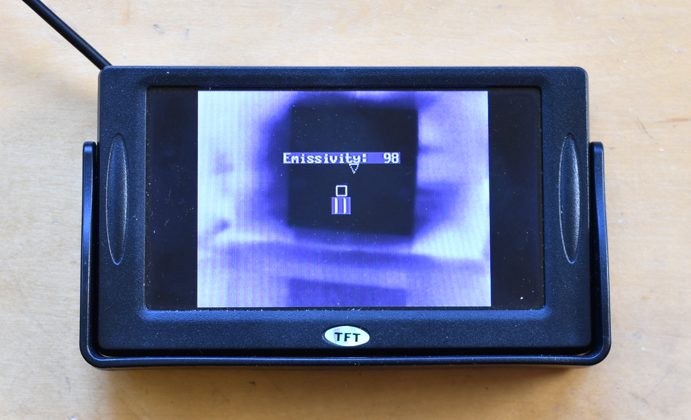
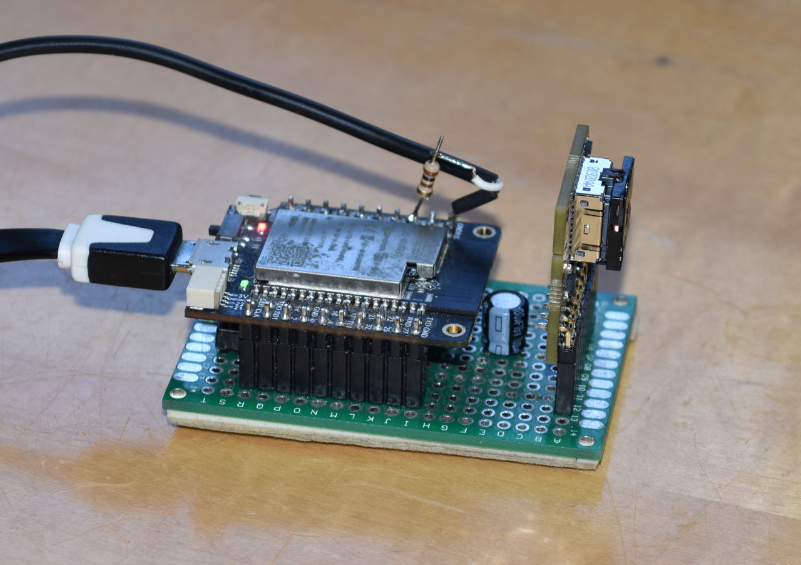
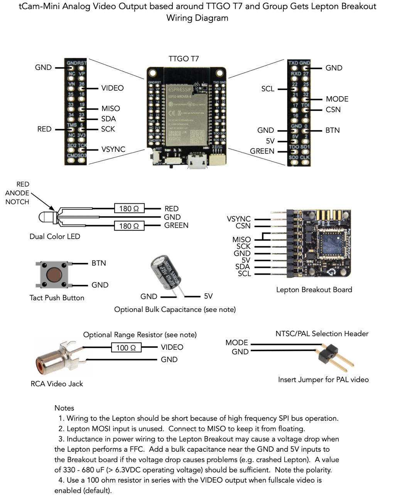

# tCam-Mini Alternate Firmware with Analog Video output
The discovery of aquaticus' wonderful [ESP32 Composite Video Library](https://github.com/aquaticus/esp32_composite_video_lib) led to a quick hack of my own [tCam-Mini](https://github.com/danjulio/tCam/tree/main/tCam-Mini) firmware to create this version which forgoes Wifi or digital hardware communication for some old-school NTSC or PAL analog video output goodness.  Great to make an inexpensive thermal imaging camera to fly on your drone with a long-distance video transmitter.



*(tCam-Mini with a cheap analog monitor)*

The video library uses the ESP32 built-in DAC and I2S peripherals to generate a monochrome analog video signal that is capable of directly driving 1V p-p 75-ohm inputs.  This code uses it to drive a slightly larger voltage range enabling up to 128 gradations of intensity (versus the default 55 levels).  A simple 100 ohm resistor in series with the DAC output, in conjunction with the 75-ohm video impedance, scales the voltage appropriately.

The firmware has the following features.

1. Works with Lepton 3.0, 3.1R or 3.5.  Radiometric Leptons configured with AGC enabled for best image quality.  Gets the full 8.7 FPS possible from the Leptons.
2. 320x240 pixel image display (linearly interpolated from Lepton 160x120 image).
2. Optionally displays the 2x2 pixel spotmeter and spotmeter temperature in the center of the image for radiometric Leptons.
3. Optionally displays min/max temperature location markers.
4. Supports both white-hot and black-hot palettes.
5. Supports setting emissivity.
6. Supports both Imperial (°F) and Metric (°C) temperature readouts.
7. Stores configurable operating parameters in ESP32 Non-volatile flash.
8. Firmware may be re-compiled with reduced number of gradations to eliminate need for external 100-ohm resistor.

The firmware is designed to run on the Revision 4 tCam-Mini using two of the Slave IF port pins for video (the Mode input is used to select between NTSC and PAL video mode outputs).  You can buy a tCam-Mini from [Group Gets](https://store.groupgets.com/products/tcam-mini-rev4-wireless-streaming-thermal-camera-board).  The firmware may also be run on "home-built" cameras using a ESP32 WROVER module and Lepton break-out board (see below).



Note that a tCam-Mini flashed with this firmware no longer supports Wifi or works with tCam.  You can always flash it back however.

## Firmware
The "firmware" directory contains a V4.4.4 Espressif ESP32 IDF project for the tCamMiniAnalog project. You should be able to build and load it into a camera using the IDF commands.  There are also a set of precompiled binaries in the "precompiled" sub-directory.  You can use the Espressif tool and instructions found below to load those into a camera without having to build the project.

### Building Firmware
These instructions assume that the IDF is installed and configured in a shell window (instructions at Espressif's [Getting Started](https://docs.espressif.com/projects/esp-idf/en/v4.4.4/esp32/get-started/index.html) web page).

#### Configure
The project ```sdkconfig``` is preconfigured with options for the project.  These typically should not need to be changed but it is important to use these configuration items since some optimizations and specific IDF configuration changes have been made.

#### Build

```idf.py build```

#### Build and load
Connect gCore to your computer and turn on.  It should enumerate as a USB serial device.  You will use the serial port device file name (Linux, OS X) or COM port (Windows) in the command below (PORT).

```idf.py -p [PORT] flash```

or 

```idf.py -p [PORT] flash monitor```

to also open a serial connection after programming so you can see diagnostic messages printed by the firmware to the serial port (```idf.py -p [PORT] monitor``` to simply open a serial connection).

#### Reconfigure project for resistor-less video output
By default the project is configured to use a larger video output range requiring an external resistor to ensure a valid analog video voltage range.  The range may be reduced obviating the need for the resistor by using ```idf.py menuconfig``` to change the video output as shown below.  Select "Component config > Composite Video Configuration" and then deselect "Enable fullscale (2.36V) DAC output".  Save the new configuration and then recompile.



### Loading pre-compiled firmware
There are two easy ways to load pre-compiled firmware into tCam-Mini without having to install the IDF and/or compile.

1. Use the Espressif Windows-only programming tool to load the firmware binaries found in the ```precompiled``` directory here.
2. You can also use the IDF command line tool ```esptool.py``` to load the firmware binaries at the locations shown below if you have it installed.

| Binary File | Load Location |
| --- | --- |
| booloader.bin | 0x1000 |
| partition-table.bin | 0x8000 |
| tCamMiniAnalog.bin | 0x10000 |

### Espressif Programming Tool setup
You can download the Espressif Programming Tool [here](https://www.espressif.com/en/support/download/other-tools).  Assuming you have downloaded the binary files in the ```precompiled``` directory to your PC, you can use this software as follows.


1. Connect tCam-Mini to your PC and turn it on.  After a few seconds Windows should recognize it as a serial device and assign a COM port to it (it is possible you will have to download and install the Silicon Labs [VCP driver](https://www.silabs.com/developers/usb-to-uart-bridge-vcp-drivers)).
2. Start the Espressif Programming Tool.
3. Select the ESP32 device.
4. Configure the software with the three binary files and programming locations as shown below.
5. Select the COM port assigned to tCam-Mini.
6. Press START to initiate programming.
7. Once programming is complete, briefly unplug and then re-plug tCam-Mini to reset it.  The LED should light indicating the firmware is running (and a video image displayed if you also have an attached monitor).



*(Selecting part type)*



*(Programming tCam-Mini)*

## Operation
Before powering tCam-Mini, connect the video output as shown below.  Also include a jumper across the Mode and GND pins to select PAL video output if desired.  The jumper position is only sampled when tCam-Mini is powered on.



tCamMiniAnalog should immediately display the following test image followed by a live thermal image.


*(Same test image for both NTSC and PAL outputs)*

Note: The NTSC output is slightly over-scanned so you may notice that the outside parts of the image are chopped off.  Some monitors allow adjustment that can bring it all onscreen.  I also found my cheap little monitor would happily display the full PAL image as well.

### USB Port
The USB Port provides power and a USB Serial interface supporting automatic ESP32 reset and boot-mode entry for programming.  It is also used for serial logging output by the firmware (115,200 baud).

#### Alternate Power
You can power tCam-Mini through the Slave IF 5V and GND pins as well (just don't connect USB at the same time).  It will happily run on any voltage between 3.5 - 5.0V meaning you can connect it directly to a LiPo battery.  This also lets you construct a 3-wire cable assembly (Power - GND - Video) that may be easy to connect to various transmitters.

### Status Indicator
A dual-color (red/green) LED is used to communicate status.  Combinations of color and blinking patterns communicate various information.

| Status Indicator | Meaning |
| --- | --- |
| Off or Dim | Firmware did not start |
| Solid Yellow | Firmware has started and is performing initialization functions |
| Solid Green | Firmware is running with no problems |
| Series of Red Blinks | A fault has been detected.  The number of blinks indicate the fault type (see table below) |


| Fault Blinks | Meaning |
| --- | --- |
| 1 blink | ESP32 I2C or SPI peripheral initialization failed |
| 2 blinks | ESP32 Non-volatile storage or WiFi initialization failed |
| 3 blinks | ESP32 static memory buffer allocation failed (potential PSRAM issue) |
| 4 blinks | Lepton CCI communication failed (I2C interface) |
| 5 blinks | Lepton VoSPI communication failed (SPI interface) |
| 6 blinks | Lepton VoSPI synchronization cannot be achieved |

Additional start-up and fault information is available from the USB Serial interface.

### Button
The button is used to set various operating parameters.

1. A short press selects between parameter values for a parameter type.
2. A long press (hold > 3 seconds) selects the next parameter type.

The following three parameter types are implemented.

1. Marker/Palette : Short presses select between four possible marker on/off and white-hot or black-hot palettes.
2. Emissivity : Short presses select between a set of 23 possible emissivity values from 10% to 100%.
3. Units : Short presses select between Imperial and Metric temperature unit display.

For parameter types 2 and 3 the firmware displays the current value on-screen as shown below.  Parameter type 1 simply changes to current display.  Changed parameters are saved to NV Flash.  The on-screen parameter menu is displayed for up to 10 seconds after the last change.



## Building your own
A camera can be constructed using an ESP32 development board, a few components and a Lepton breakout board from Group Gets.  The ESP32 development board must use the ESP32 WROVER module as it has the necessary external PSRAM the firmware requires.

Connections between the ESP32 and other devices are made through the GPIO pins documented in the "firmware/main/system_config.h" file.  Also take a look at the tCam-Mini schematic in the [hardware documents repo](https://github.com/danjulio/tCam/tree/main/tCam-Mini/hardware/documentation/rev_4).

I originally built one of the first tCam-Mini prototypes around a TTGO V7 module.  To test this firmware I just soldered the video signals right to the module on my original prototype but it is probably best to include a connector in your build.



A simplified wiring diagram is shown below.



## Contact me!
Hey, I'd like to know if you use this code and if you built your own camera or used a tCam-Mini.  Like so many others, I happily put my work out in the wild.  It's sometimes nice to know if it's ever seen and used.  You can find contact info at my [website](https://danjuliodesigns.com).